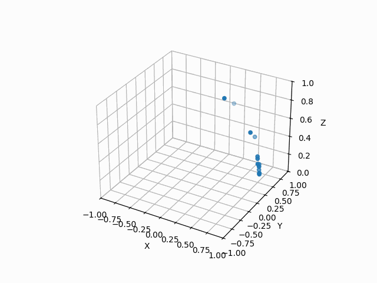
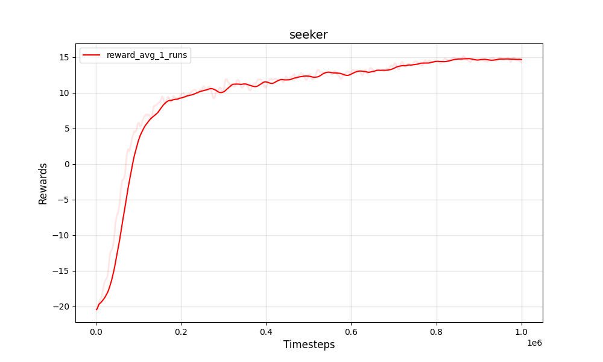
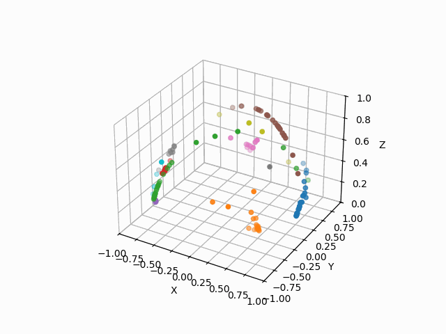
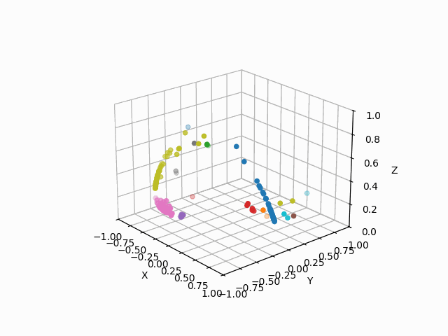
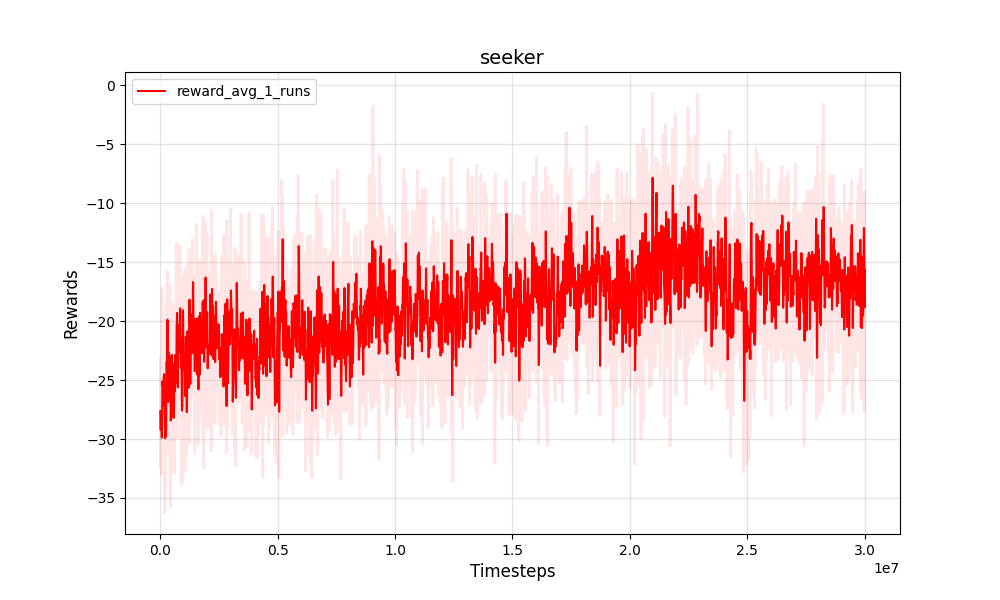

# Seeker

## Introduction

This Repository leverages Proximal Policy Optimization to determine optimal policy for seeker, a simplified space object fragmentation environment that enables one to develop optimal taskings for an optical sensor against various Resident Space Object (RSO) fragmentation events. All data is simulated. This project is intended to be suplemental to the Deep Learning short course lecture. Although the concepts behind the application to space object fragmentation are original a lot of the PPO implementation and software formatting/architecture was leveraged from this wonderful PPO Torch repo https://github.com/nikhilbarhate99/PPO-PyTorch/tree/master. I have included the bibtex below for citation in your publications.

## Usage
- For full functionality a .env file must be created and placed in the base directory of the repository with the following variables:
    DATA_PATH="{INSERT_PATH}"
    MODEL_PATH="{INSERT_PATH}"
    LOG_PATH="{INSERT_PATH}"
    FIGURE_PATH="{INSERT_PATH}"
    GIF_PATH="{INSERT_PATH}"
- To train the network : run `ppo_train.py`:
- To plot graphs using log files : run `seeker_performance_evaluation.py`
- To make a gif using a preTrained network : run `seeker_visuals.py`
- All parameters and hyperparamters to control training / testing / graphs / gifs are in their respective `.py` file

## Citing

Please use this bibtex if you want to cite the PPO PyTorch OR this repository in your publications :

    @misc{pytorch_minimal_ppo,
        author = {Barhate, Nikhil},
        title = {Minimal PyTorch Implementation of Proximal Policy Optimization},
        year = {2021},
        publisher = {GitHub},
        journal = {GitHub repository},
        howpublished = {\url{https://github.com/nikhilbarhate99/PPO-PyTorch}},
    }

    @misc{seeker,
        author = {Faber, W. R.},
        title = {Application of minimal PPO PyTorch Implementation to Seeker},
        year = {2024},
        publisher = {GitHub},
        journal = {GitHub repository},
        howpublished = {\url{https://github.com/WRFaber/seeker}},
    }

## Results
| Seeker Before PPO Training  | Seeker Reward Throughout Training Process|
| :-------------------------:|:-------------------------: |
|  |   |

| Seeker After PPO Training  | Seeker Reward Throughout Training Process|
| :-------------------------:|:-------------------------: |
|  |   |

| Seeker Before Full PPO Training  | Seeker Reward Throughout Training Process|
| :-------------------------:|:-------------------------: |
|  |   |

| Seeker After Full PPO Training  | Seeker Reward Throughout Training Process|
| :-------------------------:|:-------------------------: |
|  |   |

## Other Setup and dependencies

1. python3.11 -m venv {venv_name}
2. ./{venv_name}/Scripts/acitvate.bat
3. ensure the environment is activated by checking 'where python' and pip list
    - these should only contain the basic python setup and python version
    - it should point to your local folder
    - if this is not working switch to bash terminal and run source full path to the environments activate file.
4. to install GPU enhanced torch follow these steps
    - pip install cuda-python
    - pip3 install --pre torch torchvision torchaudio --index-url https://download.pytorch.org/whl/nightly/cu121 (Note this is due to the fact that the torch has to line up with cuda to get best gpu performance. At the time I am writing this cuda is at 12.2 and
      torch is at 12.1 support. Thus I am using the latest nightly build rather than the stable version of torch)
5. You will need other packages to include but not limited to
    - numpy
    - pandas
    - matplotlib

## References
- [PPO PyTorch](https://github.com/nikhilbarhate99/PPO-PyTorch/tree/master)
- [PPO paper](https://arxiv.org/abs/1707.06347)
- [OpenAI Spinning up](https://spinningup.openai.com/en/latest/)